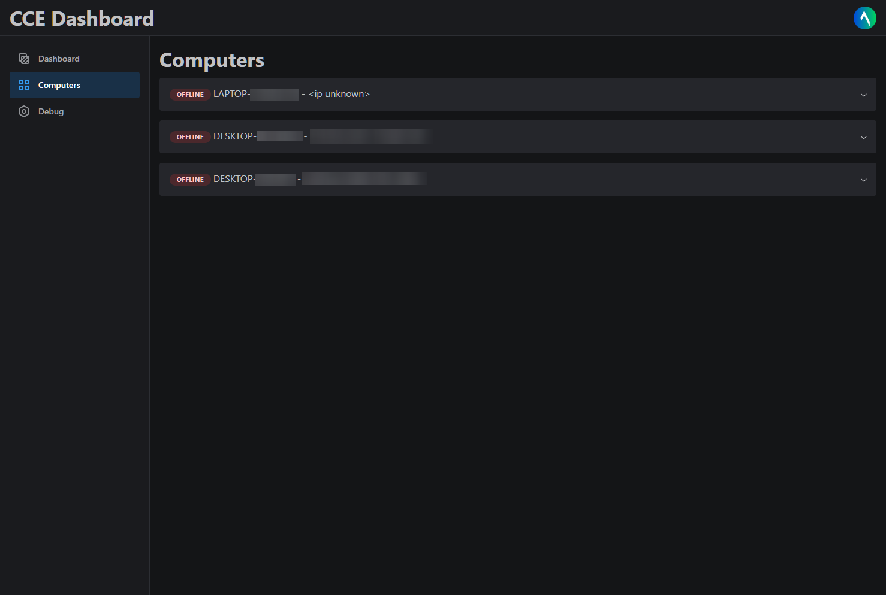

# WSS-Control

Lets you control your other Windows devices through a web interface.

**This project is for learning purposes only and should not be used in a production environment. I am not responsible for any damage caused by the use of this software.**

## App

C++ app that runs on your device. Connects to **WSS** and listens for commands.

## Web

Web interface using [Remix](https://remix.run/) and [Mantine](https://mantine.dev/). Allows for permitted users to sign in and view available devices and send commands to them.



## WSS

Node.js server that connects to the **App** and **Web** using the WebSocket protocol. More details regarding the protocol are below:

---

# Spec

All data is sent and received as JSON as UTF-8 encoded strings.

0. The client will connect to the server and send a `HELLO` (0) message

```jsonc
{
  "op": 0,
  "data": {
    "name": "DESKTOP-12345678", // the desktop name
    "os": "Microsoft Windows 10 Pro" // the desktop OS
  },
  "to": "WSS", // the target, always WSS for the client
  "from": "DESKTOP-12345678" // should always be the same as the desktop name
}
```

1. After the server receives the `HELLO` message, it will send a `REGISTER` (1) message back, indicating that it has been registered in the database

```jsonc
{
  "op": 1,
  "data": null,
  "to": "DESKTOP-12345678", // the target, always the desktop name
  "from": "WSS"
}
```

<!-- 2. The client will then send a `READY` (3) message

```jsonc
{
	"op": 3,
	"data": null,
	"to": "WSS", // the target, always WSS for the client
	"from": "DESKTOP-12345678" // should always be the same as the desktop name
}
``` -->

3. The server will send a `PING` (4) message and the client must respond with a `PONG` within 10 seconds, otherwise the client will be disconnected. A `PING` will go out
   every 5 minutes since `REGISTERED`.

```jsonc
{
  "op": 4,
  "data": null,
  "to": "DESKTOP-12345678", // the target, always the desktop name
  "from": "WSS"
}
```

```jsonc
{
  "op": 5,
  "data": null,
  "to": "WSS", // the target, always WSS for the client
  "from": "DESKTOP-12345678" // should always be the same as the desktop name
}
```

4. The server will send `EXECUTE` (7) to the clients, indicating an instruction to be done. The client must respond with a `DONE` (8) message with the same `id` as the
   `EXECUTE` message.

```jsonc
{
  "op": 7,
  "data": {
    "type": 0, // the instruction type, 0 for TEXT, 1 for SHELL
    "value": "Hello World", // what to type/execute
    "id": "e2e6c550-9b29-4fb5-8db2-8b361e1671f3" // to be used in the DONE message
  },
  "to": "DESKTOP-12345678", // the target, always the desktop name
  "from": "WSS"
}
```

```jsonc
{
  "op": 8,
  "data": "e2e6c550-9b29-4fb5-8db2-8b361e1671f3", // the id of the EXECUTE message
  "to": "WSS", // the target, always WSS for the client
  "from": "DESKTOP-12345678" // should always be the same as the desktop name
}
```

---

If there are any errors, the client may be disconnected with op 2:

```jsonc
{
  "op": 2,
  "data": {
    "message": "hello timed out" // the error message
  },
  "to": "DESKTOP-12345678",
  "from": "WSS"
}
```
